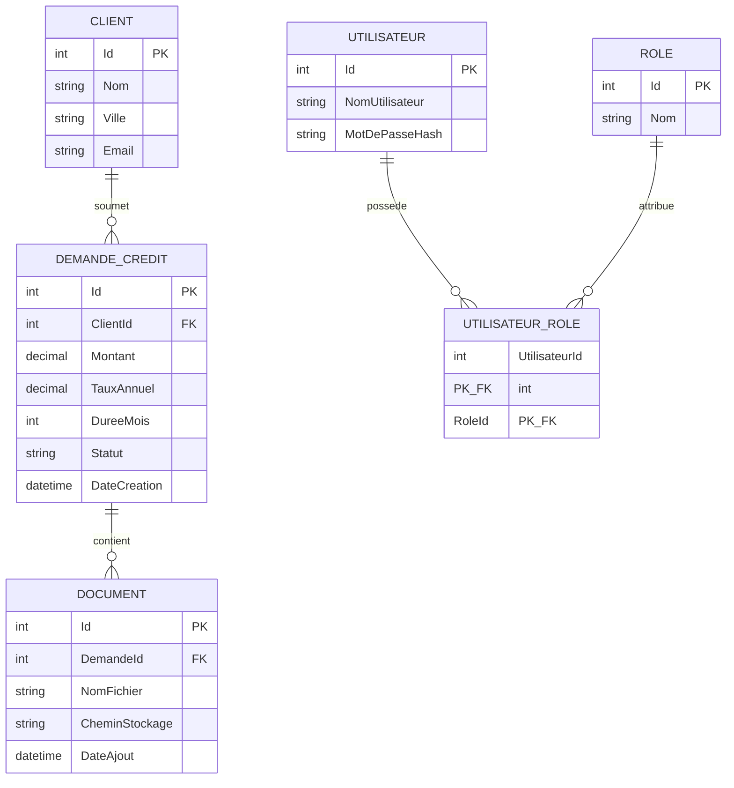

# Modèle de données - GestCredit

## Jour 11 - Modèle relationnel et modélisation

## Schéma conceptuel (ERD)

## Relations

| Relation | Cardinalité | Traitement |
|---|---|---|
| Client -> DemandeCredit | 1-N | Clé étrangère `ClientId` dans `DemandeCredit` |
| DemandeCredit -> Document | 1-N | Clé étrangère `DemandeId` dans `Document` |
| Utilisateur <-> Role | **N-N** | Table de jonction `UtilisateurRole` (clé primaire composite `UtilisateurId` + `RoleId`) |

La relation Utilisateur <-> Role est la relation N-N du modèle : un utilisateur peut cumuler
plusieurs rôles (par exemple Agent et Administrateur), et un même rôle est partagé par
plusieurs utilisateurs. Une relation N-N ne peut pas être représentée par une simple clé
étrangère : elle nécessite une table intermédiaire, ici `UtilisateurRole`, dont la clé
primaire est la combinaison des deux clés étrangères.

## Justification de la 3e forme normale (3NF)

**1NF (première forme normale)** : chaque colonne du modèle contient une valeur atomique,
non décomposable. Par exemple, la colonne `Nom` d'un utilisateur ne contient jamais une
liste de rôles concaténés dans une chaîne de caractères - les rôles sont représentés par
des lignes séparées dans une table dédiée (`Role`), reliées via `UtilisateurRole`.

**2NF (deuxième forme normale)** : chaque colonne non-clé dépend de l'intégralité de la
clé primaire, pas d'une partie seulement. Ce point est surtout pertinent pour la table de
jonction `UtilisateurRole` : sa clé primaire est composite (`UtilisateurId` + `RoleId`),
et cette table ne contient justement aucune colonne supplémentaire qui ne dépendrait que
d'une seule des deux clés - elle ne fait que représenter l'association elle-même.

**3NF (troisième forme normale)** : aucune colonne non-clé ne dépend d'une autre colonne
non-clé (pas de dépendance transitive). Par exemple, la ville d'un client n'est stockée
qu'une seule fois, dans `Client.Ville` - elle n'est jamais dupliquée dans `DemandeCredit`
même si une demande est toujours associée à un client d'une ville donnée. Pour connaître
la ville liée à une demande, on passe par la jointure `DemandeCredit -> Client`, ce qui
évite toute incohérence si l'adresse d'un client change.

## Contraintes prévues (appliquées au Jour 12 en DDL)

- `DemandeCredit.Montant > 0`
- `DemandeCredit.DureeMois BETWEEN 1 AND 360`
- `DemandeCredit.Statut` limité aux valeurs du workflow (Brouillon, Soumise, EnAnalyse, Approuvee, Rejetee)
- `Utilisateur.NomUtilisateur` unique
- `UtilisateurRole` : clé primaire composite (UtilisateurId, RoleId), empêchant les doublons d'attribution